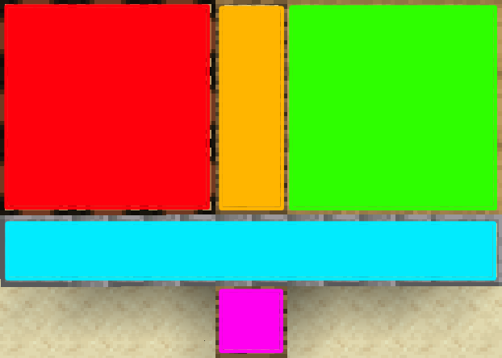

# Craft Battles

### Краткое описание

Ванильная майнкрафт игра, где игроки должны собирать свой инвентарь, используя крафты и предметы, чтобы победить других игроков

### Ссылки

* [Ресурсы](./RESOURCES.md)
* [Особые предметы](./items/ITEMS.md)
* [Инструменты](./items/TOOLS.md)
* [Биомы](BIOMES.md)

### Содержание

1. **[Ход игры](#ход-игры)**
2. **[Типы предметов](#типы-предметов)**

### Ход игры

* Игроки ходят по очереди, выполняя одно из доступных действий:
    * #### **Биом (Смена)**
        - Биом определяет ресурсы, которые можно взять
    * #### **Ресурс (Взятие)**
        - Берется случайный [ресурс](#ресурсы) в зависимости от [биома](#биом-смена)
    * **Инвентарь (Сортировка)**
        - Можно полностью изменить положение своих предметов
    * #### **Крафт**
        - Можно произвести крафт из ресурсов в верстаке
    * #### **Инструмент (Использование)**
        - Использовать инструмент (если собран) для получения нужных ресурсов
    * #### **Атака**
        - Нанести урон другому игроку 
* Как только здоровье игрока 

### Классификация предметов

#### По использованию

* ##### [Ресурсы](RESOURCES.md)
    * Используются для создания других предметов, могут быть расходуемыми в зоне инвентаря и верстака
* ##### [Предметы](ITEMS.md)
    * Используются для получения расширенных крафтов, пассивных бонусов, как расходуемые премдеты
* ##### [Инструменты](TOOLS.md)
    * Являются набором ресурсов в зоне инвентаря, используются для увеличения урона и получения бонусов при крафте

#### По типу предмета

* ##### Блок

* ##### Предмет

* ##### Еда

### Зоны

* #### Верстак [Зона](#зоны)
    * 4 слота для [Крафтов](#крафт)
    * 9 слотов если Верстак в [Зоне Предметов](#предметы-зона)

* #### Инвентарь [Зона](#зоны)
    * Зона для хранения [ресурсов](#ресурсы)
    * Зона для расходуемых [предметов](#предметы)

* #### Предметы [Зона](#зоны)
    * 3 слота где действуют [предметы](#предметы)

* #### Хранилише [Зона](#зоны)
    * Дополнительное место для ресурсов, открывается некоторыми [предметами](#предметы)

* #### Биом [Зона](#зоны)
    * Обозначает [Биом](#биом-смена) в котором игрок находится